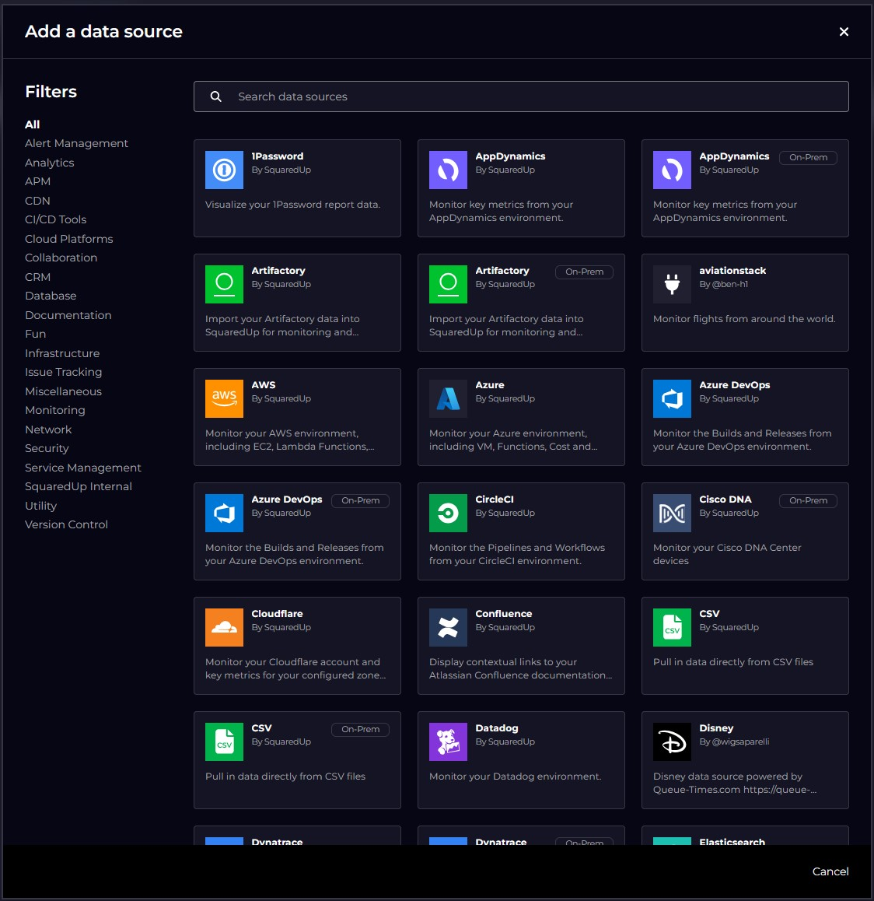

# SquaredUp Plugin Repository

This repository contains third-party/community plugins for the SquaredUp Observability Portal product.

## License

[MIT](https://choosealicense.com/licenses/mit/)

## Code of Conduct

Please read and adhere to our [Code of Conduct](./CODE_OF_CONDUCT.md) document before contributing to this repo in any way.

## Introduction

This repository is a read-only copy of the documentation and test tools inside SquaredUp's main plugins repository. This contains the
information you will need to understand the process involved in developing a plugin for the SquaredUp Observability Portal product.
It contains tooling for you to make a start on developing a plugin. However, in order actually to install a plugin into the SquareUp
product, you will need to engage with SquaredUp by emailing hello@squaredup.com.

SquaredUp Cloud plugins are vital components of the SquaredUp Unified Observability Portal product. Each 
plugin bundles up everything involved in the interaction with a specific third party system, namely:

- The ability to import objects from an external system into the Observability Portal's Data Mesh.
- The ability to read data upon demand from an external system for displaying in dashboards and/or for use in the evaluation of monitors.

Plugins are installed into the Observability Portal product as part of the product build process managed by SquaredUp. Once installed, they appear within the Data Source Gallery in the product:

## Execution Environments

A plugin may be executed in a cloud environment as part of the Observability Portal product or on a machine within a customer's premises (upon which the customer has installed a Relay Agent). If both environments are equally suitable for a plugin, it can
be declared as "hybrid" (in which case, two separate plugins will appear in the Data Source Gallery, one with the suffix
" On-Premise" automatically added).

Javascript (NodeJS) is currently the implementation language/runtime with fullest capability, but PowerShell may be chosen for plugins which will only run On-Premise. We plan to support support other languages at some point in the future.

## Limitations

- plugin code for importing objects is limited to executing for no more than 10 minutes before being terminated; if more objects need to be imported than this time limit allows, a paging context object may be returned by the plugin to request that the plugin import code be recalled at a later date (with the same paging context object) to continue the import process. This can be repeated multiple times until all objects have been imported.
- plugin code for reading data upon demand for display in dashboards is limited to executing for no more than 6 seconds before being terminated.

## Structure of a plugin

A plugin is a directory in this repo of the form `plugins/`_plugin-name_`/v1` containing certain key files:
- `metadata.json` - a file containing high-level information about the plugin (for example: the execution location of the plugin, or the information that appears in the Data Source Gallery, above).
- `ui.json` - a file describing the configuration that must be shown to a user who is in the process of adding the plugin to their tenant to connect with an instance of the back end system.
- `custom_types.json` (Optional) - a file containing information about non-standard object types that will be imported by the plugin into the Data Mesh.
- `data_streams.json` - a file describing the streams of on demand data that the Observability Portal can request of the plugin.
- `handler.js` and `package.json` the executable code of the plugin.

## How to write a plugin

The suggested way to write a new plugin is to make a copy of the `examplePlugins/hybrid/v1` directory in your `plugins/`_plugin-name_`/v1` directory and then tailor the configuration and code to interact with the specific back end as required.

This process is described in more detail in [Writing a New Plugin](docs/writingANewPlugin.md).

## Testing your plugin

There are 2 main ways to test your plugin:

1. Using the SquaredUp Test/Validation Script (`validate.js` at the root of this repo)
2. Testing within the SquaredUp Unified Observability Portal product. You would need to engage with SquaredUp to gain access to the private plugins repository before this means of testing is available to you. Contact hello@squaredup.com for more details.

You should aim to do as much testing as possible with the `validate.js` script as the turn-around time is much quicker.

This process is described in more detail in [Testing a Plugin](docs/testingAPlugin.md).
