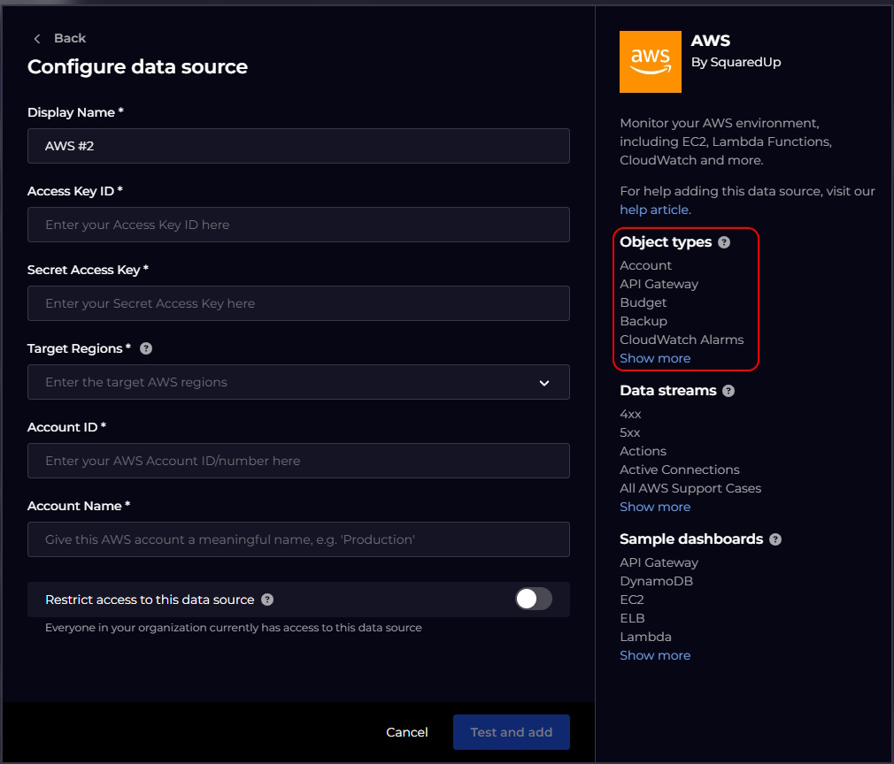
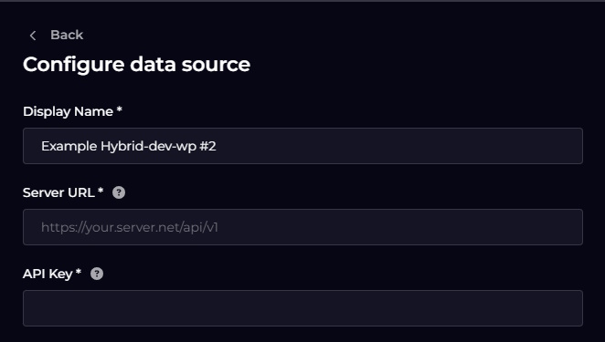

# Writing a new Plugin

  - [Getting Started](#getting-started)
  - [`metadata.json`](#metadatajson)
  - [`metadata.json` (onprem)](#metadatajson-onprem)
  - [`package.json`](#packagejson)
  - [`ui.json`](#ui.json)
  - [`handlerConfig.js (testConfig)`](#handlerconfigjs-testconfig)

## Getting Started

This section explains the changes you need to make just to make the plugin appear as a Data Source in the Data Source Gallery in the Observability Portal product, to allow end-users to configure a new instance of your plugin and have their configuration choices tested for validity.

### `metadata.json`

```json
    "name": "examplehybrid",
    "displayName": "Example Hybrid",
    "version": "1.0.0",
    "author": "Someone",
    "description": "Demonstrates the structure of a hybrid plugin.",
    "category": "Miscellaneous",
    "type": "hybrid",
    "restrictedToPlatforms": [],
    "supportsConfigValidation": true,
    "links": [{
        "url": "https://yourCompany.com/docs/plugin/pluginsetup-examplehybrid",
        "label": "Help adding this plugin"
    }],
    "keywords": ["additional", "search", "terms"],
    "objectTypes": ["App", "and", "Other", "Imported", "Object Type"],
```

You should set `name` to be the same as the name you chose in your `plugins/`_plugin-name_`/v1` directory name. The convention is for this to be all lower-case even if the directory name is mixed-case. `displayName` should be set to what you want users to see in the Data Source Gallery UI.

`version` should start as being `1.0.0`, see [Updates and Providing New Versions of Plugins](./writingANewPlugin.md#Updates-and-Providing-New-Versions-of-Plugins) for details of how to change this value after the first version.

`author` should be either your Company name or your GitHub username; it will appear in Data Source Gallery UI.

`description` should give more information about your plugin as you want it to appear in Data Source Gallery UI.

`category` defines which group in the Data Source Gallery UI your plugin appears in. Choose one of the following values:

- Alert Management
- Analytics
- APM
- CDN
- CI/CD Tools
- Cloud Platforms
- Collaboration
- CRM
- Database
- Documentation
- Fun
- Infrastructure
- Issue Tracking
- Monitoring
- Security
- Service Management
- Utility
- Version Control

`type` defines where your plugin code will execute. Choose one of the following values:

- `cloud` - your code executes in the cloud
- `onprem` - your code executes inside the customers premises on a machine with the relay agent installed
- `hybrid` - your code can run in either (two separate plugins appear in the Data Source Gallery UI, one with " On-Premise" appended to the display name value).

`restrictedToPlatforms` An array which defines which on premise agent platforms the plugin can execute on:

- `[]` - your code can execute on any agent platform (currently Windows and Linux are supported)
- `[ "windows" ]` - your code can only run on Windows based agents.
- `[ "windows", "linux" ]` - your code can execute on Windows or Linux agents.

`supportsConfigValidation` should be set to true and you should define a `testConfig()` function in `handlerConfig.js`.

`links` should be an array of useful links for users of your plugin. At the very least, you should supply one with the label "Help adding this plugin" to help users to get started with your new plugin. You are responsible for hosting the pages you link to.

`keywords` is an array of search strings in the Data Source Gallery UI for which you wish your plugin to be offered up in the results.

`objectTypes` is an array of object types you want to advertise your plugin as importing. Note that this list has no functional effect apart from populating this list in the Data Source Gallery UI:



### `metadata.json` (onprem)

For plugins of type `onprem` or `hybrid`, there is an additional field required in the `metadata.json` file:

```json
    "actions": {
        "__testConfig":        { "connector": "NodeJS", "version": "1.6.0", "config": { "scriptPath": "handler.js", "entryPoint": "testConfig"    } },
        "import":              { "connector": "NodeJS", "version": "1.6.0", "config": { "scriptPath": "handler.js", "entryPoint": "importObjects" }, "isImportAction": true },
        "datasourceUnscoped":  { "connector": "NodeJS", "version": "1.6.0", "config": { "scriptPath": "handler.js", "entryPoint": "readDataSource" } },
        "appScopedProperties": { "connector": "NodeJS", "version": "1.6.0", "config": { "scriptPath": "handler.js", "entryPoint": "readDataSource" } }
    }
```

The first two entries should always be supplied to support the `testConfig` and `importObjects` functionality. There should be additional entries for each `dataSource` configured for returning data on demand (see: [`data_streams.json`](./newPluginDataOnDemand.md#data_streamsjson))

### `package.json`

```json
{
  "name": "hybrid",
  "version": "1.0.0",
  "type": "module",
  "author": "someone",
  "license": "ISC",
  "dependencies": {
    "lodash": "^4.17.21"
  }
}
```

In this standard `npm` package file, replace the `name`, `author` and `license` fields to suit your purposes (the `version` field in this file isn't actually used; it is the `version` value in `metadata.json` that counts). Use the `npm` command to manipulate the `dependencies` as needed (this will also maintain the `package-lock.json` file which you should commit to the repo with the rest of your plugin source code).

### `ui.json`

The `ui.json` file defines how the Observability Portal product prompts a user for the information your plugin needs to connect to the 3rd-party system it interacts with. For example, the `ui.json` file in the example plugin looks like this:

```json
[
    {
        "type": "text",
        "name": "serverUrl",
        "label": "Server URL",
        "title": "Server URL",
        "help": "The URL to use",
        "validation": {
            "required": true
         },
        "placeholder": "https://your.server.net/api/v1"
    },
    {
        "type": "password",
        "name": "apiKey",
        "label": "API Key",
        "title": "API Key",
        "help": "Provide your API Key",
        "validation": {
            "required": true
        }
    }
]
```

This causes this UI to be rendered when a user adds the plugin:



(The `Display Name` prompt is added by the platform, e.g. to allow the user to distinguish between multiple instances of the same plugin.)

For a full list of the control types you can add to `ui.json`, please see: [Defining a Plugin's Configuration UI (`ui.json`)](configuringUiJson.md)

### `handlerConfig.js` (**testConfig**)

Assuming you set `"supportsConfigValidation"` to `true` in `metadata.json`, you should replace the place-holder implementation of the `testConfig()` function in `handlerConfig.js` with code that uses the supplied `pluginConfig` object to connect to your back-end system and check that the configured settings work correctly.

The code in the testConfig function should make some number of HTTP requests, using the client package of choice (`node-fetch` has been part of the NodeJS core since v18 and therefore is a good choice) to your back end system with the configuration the user has supplied (which your code can access as `context.pluginConfig`). It should push one or more `warning` or `error` messages into the `messages` array if there are problems with the details the user entered, or it can push a single `success` message before returning the result object containing the correct URL for the user to get help in the `link` property.

The function is passed a single parameter, `context`, which holds properties containing everything the function needs to know about in order to test the supplied configuration:

- `pluginConfig` - an object containing the configuration choices the end-user made when adding this instance of the plugin to their tenant.
- `log` - see: [Standard SquaredUp `api` Functions](./writingANewPlugin.md#standard-squaredup-api-functions)
- `report` - see: [Standard SquaredUp `api` Functions](./writingANewPlugin.md#standard-squaredup-api-functions)
- `patchConfig` - see: [Standard SquaredUp `api` Functions](./writingANewPlugin.md#standard-squaredup-api-functions)