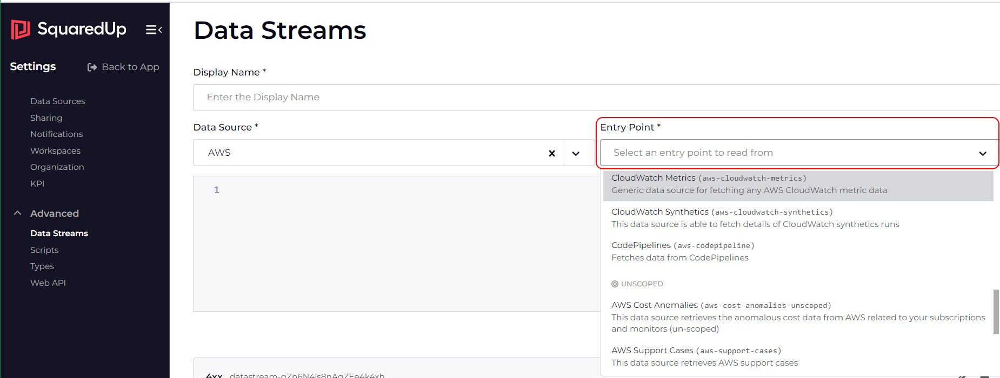

# Writing a new Plugin

  - [Data on Demand](#data-on-demand)
  - [About Scoping](#about-scoping)
  - [`data_streams.json`  ](#data_streamsjson)
    - [`matches`](#matches)
    - [`dataSources` array](#datasources-array)
    - [`rowTypes` array (optional)](#rowtypes-array-optional)
    - [`dataStreams` array](#datastreams-array)
      - [Supporting the "Generic Health" data stream](#supporting-the-generic-health-data-stream)
      - [`timeframe` support](#timeframe-support)
  - [`handlerConfig.js (readDataSource)`](#handlerconfigjs-readdatasource)
  - [`ui.json`  ](#uijson)
  - [`readDataSource/` Directory](#readdatasource-directory)

## Data on Demand

In the Observability Portal product, when a dashboard is being loaded or a monitor is being evaluated, a call is made on a plugin's `readDataSource` function to obtain fresh data from the external system to display or use in threshold calculations. (There is actually a short-term cache in the product to avoid identical calls being made in rapid succession).

A plugin author has to provide a number of different JavaScript functions to perform the business logic of these calls. These are called "Data Sources" in the code; note however, that these are now called "Entry Points" in the product UI as plugins themselves are now surfaced in the UI as "Data Sources" - apologies for the terminology changes here and please try not to get confused! These functions should be created in the `readDataSource/` directory and referenced from the `dataSourceFns` object in `handlerConfig.js`. A **dataSource** object must be provided for each of these in the `dataSources` array in the `data_streams.json` file.

In addition to the executable code in the data sources (using the original terminology), a plugin author must also provide JSON definitions of how and when the calls on these data sources should be made, as well as providing hints on how the data returned from the data source to the platform should be displayed. This information is grouped together into **dataStream** objects and entered in the other sections in the `data_streams.json` file as described in more detail below.

If you are curious, you can see evidence of the data sources declared in other plugins already installed in the Observability Portal product by going to the `Settings | Advanced | Data Streams` page. Click the `Add new data stream button`, select a "Data source" (which in this UI means "plugin" - don't panic!), you will then see an "Entry Point" drop down - it is here that you can see the data sources for the plugin you selected (don't worry, this is the worst of the terminology confusion over with now):



### About Scoping

There are fundamentally two types of on-demand data requests that can be made of a plugin:
- Global (or unscoped) - data which cannot be associated with specific imported object(s) - e.g. "Total number of active alerts"
- Scoped - data **about** specific imported object(s) - e.g. "Number of active login on server(s)"

We therefore define a basic property of a data source definition in `data_sources.json`:
- `supportedScope` this can take one of the following three values:
   - `none` - the function in the `readDataSource/` folder will not expect or receive a `targetNodes` array parameter.
   - `single` - the function in the `readDataSource/` folder will expect and receive a `targetNodes` array parameter containing a single target node (or scope object) for which it is expected to return data.
   - `list` - the function in the `readDataSource/` folder will expect and receive a `targetNodes` array parameter containing a list of target nodes (or scope objects) for which it is expected to return data.

### `data_streams.json`

This is a key file in defining a plugin's data-on-demand capabilities, containing information about the data sources (entry points) and the data stream JSON definitions that use them.

#### `matches`

The `data_streams.json` file for a plugin must declare a top-level `matches` expression. This should _always_ be `{ "__configId": { "type": "equals", "value": "{{configId}}" } }`.

#### `dataSources` array

The `data_streams.json` file for a plugin must declare a `dataSources` array with a `dataSource` object for each entry-point supported by the plugin's `readDataSource` function. Each entry is of the form:

```json
        {
            "name": "appScopedProperties",
            "displayName": "App-scoped Properties",
            "description": "Get selected properties for scoped apps",
            "supportedScope": "list",
            "targetNodesProperties": ["id", "name", "sourceId"]
        }
```
...where the name is used to reference the data source from data stream JSON and the other three properties are for descriptive purposes in the UI (see the previous screen-shot showing the **Entry Point** drop-down). The values for `supportedScope` are described in [About Scoping](#about-scoping).

The optional `targetNodesProperties` property is only relevant for `supportedScope` = `single` or `list` and controls how much of each target node object is passed to the `readDataSource` function at run-time. By default, the whole of each target node is sent. For large scopes, this can turn out to be a lot of data (which can be problematic for on-prem plugins). It is best to configure data sources so that only the node properties actually required by the code get sent.

#### `rowTypes` array (optional)

A part of the configuration of a data stream is to control how the platform displays the various columns in tabular data returned (this is called column `metadata`, not to be confused with the plugin's metadata in `metadata.json`). It is highly likely that more than one data stream will return the same sort of data. Each entry in the `rowTypes` array provides column metadata that can be referenced by many individual data streams by name so that they do not need to declare their own copy. An entry in the `rowTypes` array takes the form:

```json
        {
            "name": "rowName",
            "metadata": [
                { "name": "title",                    "displayName": "Title",                    "shape": "string" },
                { "name": "issueType",                "displayName": "Issue Type",               "shape": "string" },
                { "name": "created_at",               "displayName": "Created At",               "shape": "date" },
                { "name": "updated_at",               "displayName": "Updated At",               "shape": "date" }
            ]
        }
```

#### `dataStreams` array

This array contains an entry for each data stream the plugin wants to show within the UI of the dashboard designer for users to use when creating **data** tiles.

Here are a couple of (non-trivial) example data streams as an introduction. Each contains the name of the data source (entry point) that will be called to obtain the data at run-time (in the `dataSourceName` property):

This is a data stream which is hidden from the UI (by the `"options": { "noMatch": true }`) which provides data for populating a drop-down list in the second (configurable) data stream (indicated by the `"provides": "templateData"`). This stream has its own column `metadata`:

```json
        {
            "displayName": "Metrics list", 
            "description": "Get the list of available metrics",
            "dataSourceName": "metricListSource",
            "definition": { 
                "name": "metricListStream",
                "timeframes": false,
                "provides": "templateData",
                "options": { "noMatch": true },
                "dataSourceConfig": {},
                "rowPath": [],
                "matches": "all",
                "metadata": [
                    { "name": "name.value", "shape": "string", "displayName": "Type", "role": "value" }
                ]
            }
        }
```

This is a configurable data stream (the presence of the `template` node makes this so). When a user is using a configurable data stream, they will be prompted for more information in the third step of the tile editor (currently called **Query**, but this may well change). The schema of the JSON allowed inside the `template` node is very similar to that available in the ui.json file (see: [Defining a Plugin's Configuration UI (`ui.json`)](configuringUiJson.md) for available field types). This stream uses shared column metadata in the `rowTypes` array with the name "metricCustom":

```json
        {
            "displayName": "Monitor Metric",
            "description": "Monitor Metric",
            "dataSourceName": "metricSource",
            "definition": {
                "name": "metricSingle",
                "dataSourceConfig": {},
                "rowPath": ["timeseries", "data"],
                "matches": {
                    "sourceType": { "type": "equals", "value": "myobjecttype" }
                },
                "rowType": { "name": "metricCustom" }
            },
            "template": [
                {
                    "name": "metricNamesStream",
                    "type": "autocomplete",
                    "label": "Metric Name",
                    "title": "Metric Name",
                    "help": "Supply a metric name",
                    "validation": { "required": true },
                    "placeholder": "-",
                    "isMulti": false,
                    "data": {
                        "source": "dataStream",
                        "dataStreamName": "metricListStream",
                        "dataSourceConfig": {}
                    }
                }
            ]
        }
```

#### Supporting the "Generic Health" data stream

The Observability Portal can color-code your imported objects in the UI based on their _current_ health state. It does this by calling a scoped data stream supplied by the author of the plugin that matches the object and is declared with this top-level property: `"provides": "health"` - for example:

```json
        {
            "displayName": "App Health",
            "description": "Returns Health for scoped Apps",
            "dataSourceName": "appScopedProperties",
            "provides": "health",
            "definition": {
                "name": "appHealth",
                "timeframes": false,
                "dataSourceConfig": { "properties": ["appStatus", "appType"] },
                "rowPath": [],
                "matches": {
                    "sourceType": { "type": "equals", "value": "mySortOfApp" }
                },
                "metadata":  [
                    { "name": "appStatus",                "displayName": "Status",                   "shape": ["state",
                                                                                                   { "map": { "success": ["OK"], "warning": ["Degraded", "Installing"], "error": ["Broken"] } }
                    ]},
                    { "name": "name",                     "displayName": "Name",                     "shape": "string", "role": "label" },
                    { "name": "id",                       "visible": false,                          "shape": "string", "role": "id" },
                    { "name": "appType",                  "displayName": "App Type",                 "shape": "string" }
                ]
            }
        }
```

Apart from the crucial `"provides": "health"`, other important points to note are:

- One of the columns must return the scoped objects' current state (i.e. with `"shape": "state"`)
- There must be a column marked `"role": "id"` - this must contain the value of the `id` property from the entry in the `targetNodes` array to which this row in the returned data applies. (N.B. the end-user won't be interested in seeing this, so be sure to mark it with `"visible": false`).
- You have a choice regarding whether this stream is visible in the tile editor or not. If you specify a top-level node ` "options": { "noMatch": true }`, the stream will not appear in the tile editor. If you choose to make this a visible stream, you may wish to add other properties to the rows returned (which will be ignored when the stream is called by the platform to get object health).

#### `timeframe` support

Dashboards and tiles can be configured to show data for specific ranges of time (usually ending in "now"). The requested timeframe value is passed into a plugin's `readDataSource` function in the context object. It takes the form:

```json
{
    "start": "2023-11-01T00:00:00.000Z",
    "unixStart": 1698796800,
    "end": "2023-11-30T23:59:59.999Z",
    "unixEnd": 1701388799,
    "enum": "thisMonth",
    "interval": "PT12H"
}
```
...where `start` and `end` are times as strings in [ISO 8601 format](https://www.digi.com/resources/documentation/digidocs//90001488-13/Default.htm#reference/r_iso_8601_date_format.htm), `unixStart` and `unixEnd` are numeric [Unix time](https://developer.mozilla.org/en-US/docs/Glossary/Unix_time) values, `enum` is the timeFrame as an enum value (see below) and `interval` is a suggested period between samples for time-stream data as an [ISO 8601 duration string](https://www.digi.com/resources/documentation/digidocs//90001488-13/reference/r_iso_8601_duration_format.htm).

The possible enum values are:
	`last1hour`,
	`last12hours`,
	`last24hours`,
	`last7days`,
	`last30days`,
	`thisMonth`,
	`thisQuarter`,
	`thisYear`,
	`lastMonth`,
	`lastQuarter` and
	`lastYear`.

Data streams can (and _should_) declare what time frame they support:
- some data streams return data with no concept of time and should declare this by specifying `"timeframes": false` as shown in [Supporting the "Generic Health" data stream](#supporting-the-generic-health-data-stream) section above.
- if `timeframes` is not specified, the platform will assume the stream can support all possible timeframes.
- if only a subset of timeframes is supported, this can be declared by specifying a string-array, like `"timeframes": ["lastMonth", "lastQuarter", "lastYear"]`.

More information about data stream configuration can be found in the [Data Streams Developer Guide](https://squaredup-eng.atlassian.net/wiki/spaces/PPD/pages/26922638409740/Data+Streams+Developer+Guide) on Confluence.

### `handlerConfig.js` (**readDataSource**)

In `handlerConfig.js`, you should add a JavaScript `import` statement for each data source function at the top of the file. You should add a reference to each function in the `dataSourceFns` object.

### `readDataSource/` Directory

For each data source, you should create an read data source function in its own source file in the `readDataSource/` directory. This function will be called as required when the platform is obtaining data for display in dashboards or for monitor calculations.

The function is passed a single parameter, `context`, which holds properties containing everything the function needs to know about the import in progress:

- `pluginConfig` - an object containing the configuration choices the end-user made when adding this instance of the plugin to their tenant.
- `dataSource` - the data source object for reference (from `data_streams.json`).
- `dataSourceConfig`- the specific configuration options from the data stream for the data source.
- `targetNodes` - the objects in scope for this data request (where appropriate: see [About Scoping](#about-scoping) - e.g. if the data source is declared as `"supportedScope": "single"`, this array is guaranteed to contain a single element).
- `timeframe` - the time range for which data is required (where appropriate: not all data streams honour timeframes - see the `timeframes` property in the data stream definition).
- `log` - see: [Standard SquaredUp `api` Functions](./writingANewPlugin.md#standard-squaredup-api-functions)
- `report` - see: [Standard SquaredUp `api` Functions](./writingANewPlugin.md#standard-squaredup-api-functions)
- `patchConfig` - see: [Standard SquaredUp `api` Functions](./writingANewPlugin.md#standard-squaredup-api-functions)

The code in the import function should make a small number of HTTP requests (remember there is a strict 6 second time limit for read data source functions), using the client package of choice (`node-fetch` has been part of the NodeJS core since v18 and therefore is a good choice) to obtain the requested data.

#### `targetNodes` objects

When the data source function is expecting scope objects (see [About Scoping](#about-scoping)), the objects that appear in the `targetNodes` array are _similar_ to the objects the plugin returned in the vertices array during object import, _but not identical_! The crucial difference is that all scalar properties will have been converted into single-element arrays.

You will find a function in the example plugin's `util.js` source file: `getScalar(obj, propertyName)` which you should get into the habit of using to fish scalar properties out of objects in the `targetNodes` array.

**Important note. Scalar properties in imported objects will appear as single-element arrays when they are in scope and passed to readDataSource functions in the `targetNodes` array (use the supplied `getScalar` function)!**