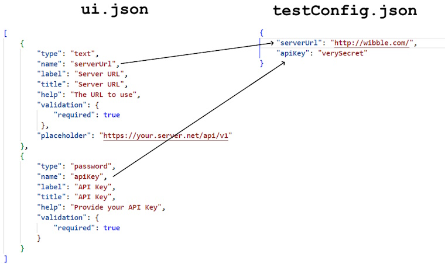

# Testing a Plugin

## `validate.js`

When you first start developing a plugin, the validate.js script in the root folder of the [squaredup-plugin-repository](https://github.com/squaredup/squaredup-plugin-repository) repo is the best way to start testing your code.

To get the most of this, you should create a `testConfig.json` file in the source folder where you plugin code resides. This should represent an object where the properties provide responses to the prompts in your plugin's `ui.json` file.

For example:



`testConfig.json` files are excluded from commits to the repo by its `.gitignore` file, so there should be no risk of any secret values you put in here getting committed into the repo. Delete the file as soon as you have completed testing to protect any credentials.

You can then test your plugin by running this command-line (assuming your working directory is the root of the repo):

```
node validate.js --testPlugin .\plugins\myPlugin\v1\
```

....although, in practice, you will usually want to be running the code under a debugger in the early stages of plugin development. Assuming you are using Visual Studio Code as your development environment, you can achieve this with an entry like this in your `launch.json` file:

```json
        {
            "name": "Test myPlugin",
            "program": "${workspaceFolder}/validate.js",
            "args": ["-t", "plugins/myPlugin/v1"],
            "request": "launch",
            "skipFiles": ["<node_internals>/**"],
            "type": "node",
            "console": "integratedTerminal"
        }
```
(don't forget the `"console": "integratedTerminal"`; without it, the `validate.js` script will hang when it prompts for user input).

When the script runs, it performs various static analysis steps and displays the results. It then tests your testConfig() function, the importObjects() function an prompts for data stream testing as shown here:

```
metadata.json matches schema
ui.json matches schema
data_streams.json matches schema
custom_types.json matches schema
Installing node packages...

Testing testConfig()
{
  link: 'https://yourCompany.com/docs/plugin/pluginsetup-examplehybrid',
  messages: [
    { status: 'warning', message: 'serverUrl is invalid' },
    { status: 'error', message: 'nothing works!' }
  ]
}

Testing importObjects()
Plugin  INFO: importObjects starts: stage=0, apiLimits={"apps":10,"buildings":10}, maxElapsedTimeMSecs=600000, maxPayloadSize=2097152
Plugin  INFO: Getting page of 10 apps from 0
Plugin  INFO: importObjects looping: elapsed = 1, payloadSize=1600, pagingContextSize=59
Plugin  INFO: Getting page of 10 apps from 10
Plugin  INFO: importObjects looping: elapsed = 2, payloadSize=3122, pagingContextSize=59
Plugin  INFO: Getting page of 10 apps from 20
Plugin  INFO: importObjects looping: elapsed = 2, payloadSize=4645, pagingContextSize=59
Plugin  INFO: Getting page of 10 apps from 30
Plugin  INFO: importObjects loop ends
The plugin data is valid (edges are empty)
Imported 37 vertices and 0 edges:
    37 vertices of type app

Testing readDataSource()
? Which dataStreamName do you want to test? (Use arrow keys)
> (Quit) 
  appHealth 
  stuffUnscoped 
```

(In the example above, the import is returning hard-coded objects, which is why it appears to work even though the preceding `testConfig()` test call showed errors).

You can then choose a data stream to test. Once the test is complete, you can continue to choose other data streams to test until you select "`(Quit)`":

```
Testing readDataSource()
? Which dataStreamName do you want to test? appHealth
Testing appHealth - matches: {"sourceType":{"type":"equals","value":"mySortOfApp"}}
? Do you want to select targetNodes individually or use all 37 nodes? Select targetNodes individually
? Add another target node to the 0 already selected? Application #1 (app|mySortOfApp)
? Add another target node to the 1 already selected? Application #2 (app|mySortOfApp)
? Add another target node to the 2 already selected? (Done)
[
  {
    id: 'node-1',
    name: 'Application #1',
    sourceId: 'app_1',
    appStatus: 'Degraded',
    appType: 'Web'
  },
  {
    id: 'node-2',
    name: 'Application #2',
    sourceId: 'app_2',
    appStatus: 'OK',
    appType: 'Web'
  }
]

? Which dataStreamName do you want to test? (Use arrow keys)
> (Quit)
  appHealth
  stuffUnscoped
```

Note at this time that the script returns the raw payload from each call on `readDataSource()`; it does not honour the `rowPath` setting you have chosen. You should check the output visually to check that the data you wish to see in dashboards is actually present at the appropriate location in the payload your plugin returns for each stream.